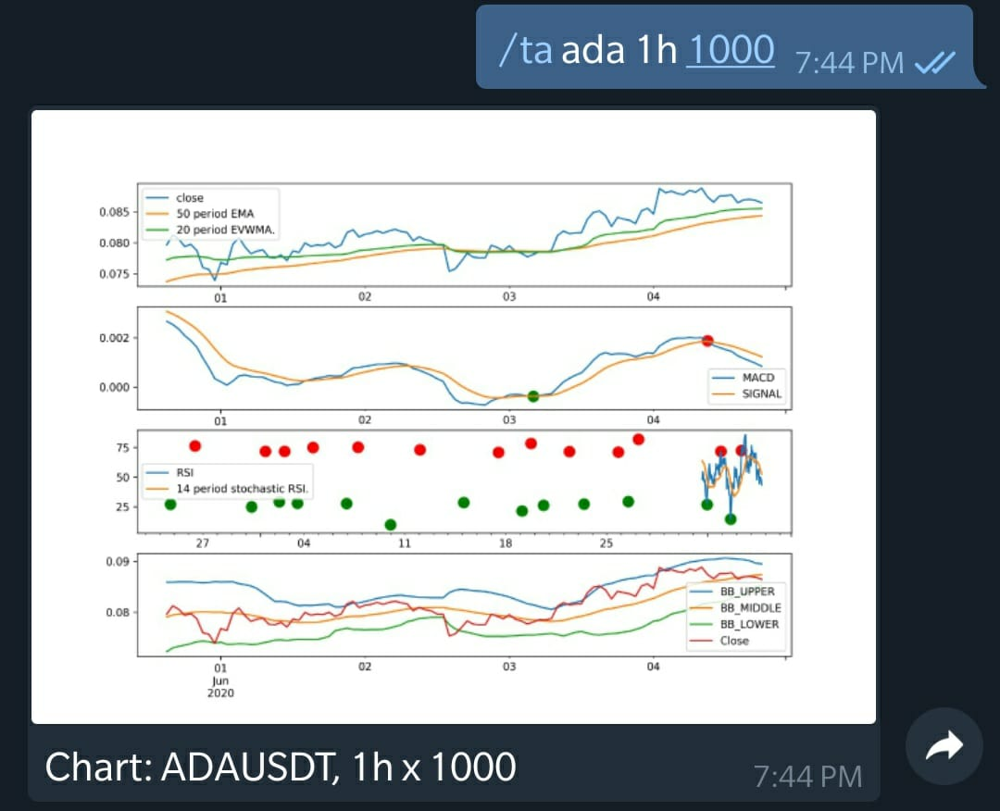
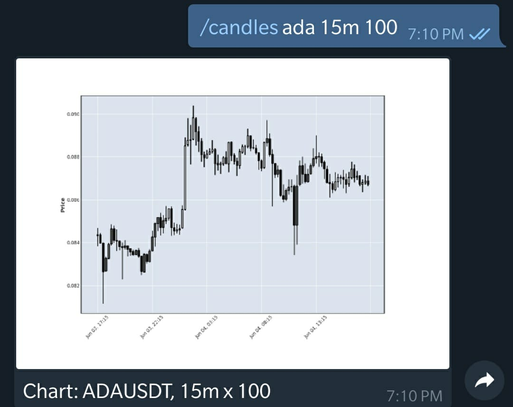

This is an unplanned tool that turned into something nice and so useful. I was playing with Python, and Binance API when  I realized that there are many things that I check so frequently, wouldn't it be nice to just fire a command from the Phone and get an answer within seconds? Or what about scheduling something to run over and over without having to remember it.

This tool is a Telegram bot, that supports various Trading commands by authorized handles.
The Backend APIs are provided by Binance which supports quite a lot of features for Cryptocurrency Trading.

# Prerequisites of this Tool
- A Telegram Bot and Its API Key
- Binance Account and API Key and Secret

# Running the tool
1. Install Dependencies `pip install -r requirements.txt`
2. Run the script `python bot.py --log=INFO|DEBUG`  
3. Or run with Docker: `./docker.sh`
In case you haven't configured it already, you will get a message.
Please follow the next section for Configuration.

# Configuration
The Configuration is a JSON file maintained at the following location: `config/config.json`. 
The directory also contains a Template file which should be used to configure it.

Please fill the following details in the config file.
```
  "telegramApiKey": "----",
  "binanceApiKey": "----",
  "binanceApiSecret": "----",
  "adminUserId": "----"
```

You can also provide some other UserIDs to give access to other accounts for certain Commands.
You can create a named group under accessContro.groups node and provide a list of telegram userIDs. 
```
  "accessControl": {
    "groups": {
    "private": [ "----","---"],
    ...
```

# Features Overview
- Provide many useful features that a trader might be interested in without having to check it manually 
- Provides simple commands which can be used through telegram bot, check the Commands in Next section
- Provides the indicator of price movement over a threshold
- Provide technical Analysis of the assets using TA
   - MACD Crossover
   - RSI, Stoch RSI
   - Bollinger Bands
   - EMA, EVWMA Crossovers
   - ADX Trend Strength Indicator
   - Canle Stick Charts and Dragonfly Doji Marks
- Provide Account management on Binance
- Schedule a Command that runs periodically
- Place Buy / Sell Order using simple commands
- Easily manage Stoploss and Trailing Stoploss with a percentage Threshold


# Screenshots




# Commands
## Asset Management Commands
| Command  | Details| Examples |
| :---- | :---- | :----|
| symboladd | adds a Symbol in local store     | `/symboladd ADA`   |
| symbolrm  | remove a Symbol in local store   | `/symbolrm ADA`  |
| now       | Current Price of all Assets in USD      | `/now` |
| hot       | Any movement in prices in last N slots of given timeframe above percentage threshold | `/hot 5m 6 3`  <br />All Assets with price movements of 3% in 6x5m window |

## Trading Commands
| Command  | Parameters| Examples |
| :---- | :---- | :----|
| bal | Get Balance of all Assets | `/bal` |
| balpie | Get Pie chart of all balances, easier to know the weitage of each asset | `/balpie` |
| snapshot | Get a snapshot of all Assets in the account | `/snapshot` |
| snapshotbal | Get the Price of the snapshot taken last time (and Blame yourself in hindsight) | `/snapshotbal` |
| TODO |  |  |
## Technical Analysis Commands
| Command  | Parameters| Examples |
| :---- | :---- | :----|
| ta | Technical Analysis on Predefined Charts | `/ta ADA 1h 1000 `<br />Find TA of the Assets with 1h timeframe and 1000 bars |
| hints | Result of Technical Analysis without Charts | `/hints ADA 1h 1000 `<br />Find TA of the Assets with 1h timeframe and 1000 bars |
## Scheduling
| Command  | Parameters| Examples |
| :---- | :---- | :----|
| schdinfo | Get the list of all Schedules commands | `/schdinfo` |
| schd | Create a Scheduled Command | `/schd 600 bal` <br /> Get Balance in you accound in every 600 seconds |
| schdcancel | Cancel all Commands with given command name | `/schdcancel bal`<br />It will cancel all scheduled /bal commands |
## Conditional Commands
| Command  | Parameters| Examples |
| :---- | :---- | :----|
| Ifabove | Run another command if the price of the asset is ABOVE the specified value |   |
| Ifbelow | Run another command if the price of the asset is BELOW the specified value |   |


# Modules Used
- Finta: For all Financial Technical Analysis using KLINES
- schedule: For scheduling Tasks
- python-binance: For Connecting to Binance
- mplfinance: For Klines charts
- matplotlib: for Plottign the Charts and generating Images 

# Docker
Build it: 
`docker build --tag chatbot-telegram:0.1 .`   

Run it:
`docker run -it chatbot-telegram:0.1`

#### 

# ToDo
- Publish it as a Python module and provide command line option for Config file location
- The Docker image used is quite large due to the usages of Matplotlib, some work needs to be done to get it running with something slimmer
